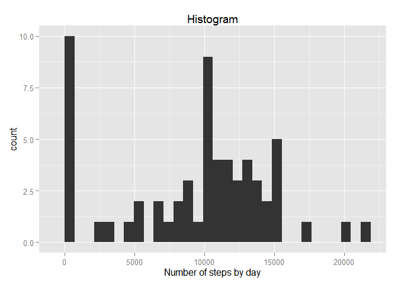
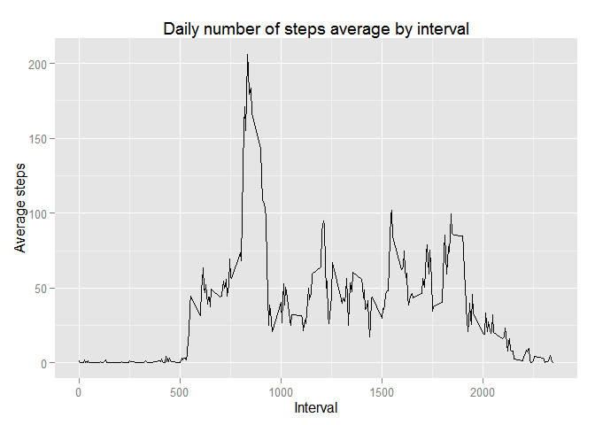
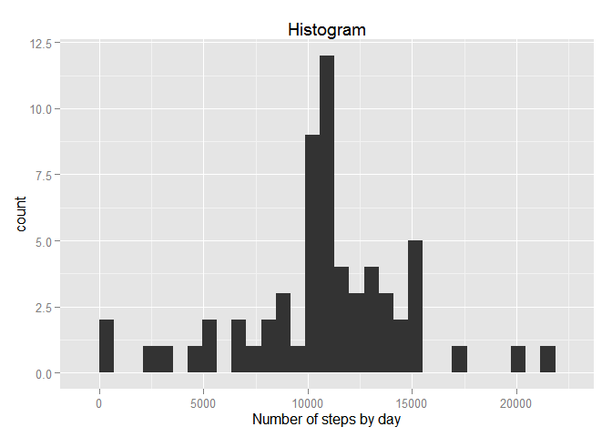
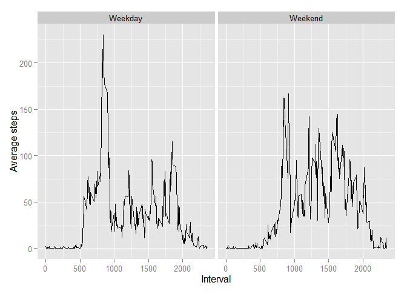

# Reproducible Research: Peer Assessment 1


## Loading and preprocessing the data

###Data Description
*This assignment makes use of data from a personal activity monitoring device. This device collects data at 5 minute intervals through out the day. The data consists of two months of data from an anonymous individual collected during the months of October and November, 2012 and include the number of steps taken in 5 minute intervals each day.*

The variables included in this dataset are:

**steps:** Number of steps taking in a 5-minute interval (missing values are coded as NA)

**date:** The date on which the measurement was taken in YYYY-MM-DD format

**interval:** Identifier for the 5-minute interval in which measurement was taken

The dataset is stored in a comma-separated-value (CSV) file and there are a total of 17,568 observations in this dataset.

###Data Loading
I need to donwload the zip file from the provided source  

```r
url <- "http://d396qusza40orc.cloudfront.net/repdata%2Fdata%2Factivity.zip"
temp <- tempfile()
download.file(url,temp)
```
I now extract the data inside the zip file and load in a dataframe called data  

```r
data <- read.table(unz(temp,"activity.csv"),header = TRUE, sep = ",")
unlink(temp)
```
Now I'll make sure the data was loaded properly, for which I request a `str` of the dataframe

```r
str(data)
```

```
## 'data.frame':	17568 obs. of  3 variables:
##  $ steps   : int  NA NA NA NA NA NA NA NA NA NA ...
##  $ date    : Factor w/ 61 levels "2012-10-01","2012-10-02",..: 1 1 1 1 1 1 1 1 1 1 ...
##  $ interval: int  0 5 10 15 20 25 30 35 40 45 ...
```

###Data preprocesing - Date coercing
As we can see, the dates are presented as a factor, need to convert into date format using `as.date`

```r
data$date <-  as.Date(data$date)
str(data)
```

```
## 'data.frame':	17568 obs. of  3 variables:
##  $ steps   : int  NA NA NA NA NA NA NA NA NA NA ...
##  $ date    : Date, format: "2012-10-01" "2012-10-01" ...
##  $ interval: int  0 5 10 15 20 25 30 35 40 45 ...
```

## What is mean total number of steps taken per day?
###Data preprocesing - Aggregate steps by day
The data contains information about the number of steps in a 5 minute interval. Need to aggregate the data to summarize the munber of steps by day. 
Will ignore `NA` for now

```r
##Summarize data, suming up steps by date
aggdatadate <-aggregate.data.frame(data$steps, by=list(date=data$date),FUN=sum, na.rm=TRUE)
str(aggdatadate)
```

```
## 'data.frame':	61 obs. of  2 variables:
##  $ date: Date, format: "2012-10-01" "2012-10-02" ...
##  $ x   : int  0 126 11352 12116 13294 15420 11015 0 12811 9900 ...
```
Going to build a histogram of the data, need to load the `ggplot2` library

```r
library(ggplot2)
```
Make the Histogram

```r
qplot(aggdatadate$x, geom="histogram", main = "Histogram", xlab = "Number of steps by day")
```

```
## stat_bin: binwidth defaulted to range/30. Use 'binwidth = x' to adjust this.
```

 

Let's calculate the mean

```r
mean(aggdatadate$x)
```

```
## [1] 9354.23
```
Let's calculate the median

```r
median(aggdatadate$x)
```

```
## [1] 10395
```

## What is the average daily activity pattern?
To do this I need to average the number of steps by interval, across all the days  

###Data preprocesing - daily averages by interval

```r
##Summarize data, suming up steps by interval
aggdataint <-aggregate.data.frame(data$steps, by=list(interval=data$interval),FUN=mean, na.rm=TRUE)
str(aggdataint)
```

```
## 'data.frame':	288 obs. of  2 variables:
##  $ interval: int  0 5 10 15 20 25 30 35 40 45 ...
##  $ x       : num  1.717 0.3396 0.1321 0.1509 0.0755 ...
```
Let's make a line plot to explore the mean daily average by interval


```r
qplot(aggdataint$interval,aggdataint$x,geom="line", main = "Daily number of steps average by interval", xlab = "Interval",ylab="Average steps")
```

 

Find out what the interval and max average is

```r
##Extract the interval where the average is max
aggdataint[which.max(aggdataint$x),]
```

```
##     interval        x
## 104      835 206.1698
```

Looks like for the first 500 intervals, it doesn't seem to be a lot of activity, I assume is during the sleeping cycle. At interval **835** the level of activity peaks to an average of **206.1** steps, probably during a workout routine in the morning

## Imputing missing values
How many missing values are in the dataset?

```r
sum(is.na(data))
```

```
## [1] 2304
```

To address the issue of missing values, will substitute the missing values with the overall average for the given interval using the data prepared in the previous question `aggdataint`

Merge `data` and `aggdataint` by interval

```r
datanomissing <- merge(data, aggdataint, by = "interval")
head(datanomissing)
```

```
##   interval steps       date        x
## 1        0    NA 2012-10-01 1.716981
## 2        0     0 2012-11-23 1.716981
## 3        0     0 2012-10-28 1.716981
## 4        0     0 2012-11-06 1.716981
## 5        0     0 2012-11-24 1.716981
## 6        0     0 2012-11-15 1.716981
```
Find out the positions of the intervals by date that are `NA` and substitute with the average

```r
nas <- is.na(datanomissing$steps)
##Substitute with average
datanomissing$steps[nas] <- datanomissing$x[nas]
head(datanomissing)
```

```
##   interval    steps       date        x
## 1        0 1.716981 2012-10-01 1.716981
## 2        0 0.000000 2012-11-23 1.716981
## 3        0 0.000000 2012-10-28 1.716981
## 4        0 0.000000 2012-11-06 1.716981
## 5        0 0.000000 2012-11-24 1.716981
## 6        0 0.000000 2012-11-15 1.716981
```
How many missing values are in the dataset?

```r
sum(is.na(datanomissing))
```

```
## [1] 0
```

Zero as expected!  
Aggregate the data by day, using the new data with `NA` imputed to the interval average

```r
##Summarize data, suming up steps by date
aggdatadatenona <-aggregate.data.frame(datanomissing$steps, by=list(date=datanomissing$date),FUN=sum, na.rm=TRUE)
str(aggdatadatenona)
```

```
## 'data.frame':	61 obs. of  2 variables:
##  $ date: Date, format: "2012-10-01" "2012-10-02" ...
##  $ x   : num  10766 126 11352 12116 13294 ...
```
Make a histogram with the new data 

```r
qplot(aggdatadatenona$x, geom="histogram", main = "Histogram", xlab = "Number of steps by day")
```

```
## stat_bin: binwidth defaulted to range/30. Use 'binwidth = x' to adjust this.
```

 

Let's calculate the mean

```r
mean(aggdatadatenona$x)
```

```
## [1] 10766.19
```
Let's calculate the median

```r
median(aggdatadatenona$x)
```

```
## [1] 10766.19
```
The mean increased because when calculating the mean with the missing values, they ended up considered as zero values as the comparison of the before and after histograms show. Now with the `NA' imputed with a value higher than zero, the result is a shift upwards in the mean  
The median didn't change much

## Are there differences in activity patterns between weekdays and weekends?

###Data preprocesing - Add weekday and weekend to data
Need to add day of the week first and then the tag weeday/weekend to the data with imputed values 


```r
##Adding day of the week to dataset
datanomissing$Dayofweek <- weekdays(datanomissing$date)
##Add a column to tag as weekday or weekend based on the day of the week
datanomissing$type <- ifelse(datanomissing$Dayofweek == "Saturday" | datanomissing$Dayofweek == "Sunday", "Weekend", "Weekday")
datanomissing$type <- as.factor(datanomissing$type)
str(datanomissing)
```

```
## 'data.frame':	17568 obs. of  6 variables:
##  $ interval : int  0 0 0 0 0 0 0 0 0 0 ...
##  $ steps    : num  1.72 0 0 0 0 ...
##  $ date     : Date, format: "2012-10-01" "2012-11-23" ...
##  $ x        : num  1.72 1.72 1.72 1.72 1.72 ...
##  $ Dayofweek: chr  "Monday" "Friday" "Sunday" "Tuesday" ...
##  $ type     : Factor w/ 2 levels "Weekday","Weekend": 1 1 2 1 2 1 2 1 1 2 ...
```
Summarize the data by type (weekday or weekend)and interval, taking the average

```r
##Summarize data, average steps by interval by type
aggdatatype <-aggregate.data.frame(datanomissing$steps, by=list(type=datanomissing$type,interval=datanomissing$interval),FUN=mean, na.rm=TRUE)
str(aggdatatype)
```

```
## 'data.frame':	576 obs. of  3 variables:
##  $ type    : Factor w/ 2 levels "Weekday","Weekend": 1 2 1 2 1 2 1 2 1 2 ...
##  $ interval: int  0 0 5 5 10 10 15 15 20 20 ...
##  $ x       : num  2.2512 0.2146 0.4453 0.0425 0.1732 ...
```
2 pane plot

```r
qplot(interval,x, data=aggdatatype,facets = .~type,geom = "line",ylab="Average steps",xlab="Interval")
```

 

Looks like during the weekend, the level of activity seems to be more constant, while during the week it tends to have a peak and then followed with a period of low activity
